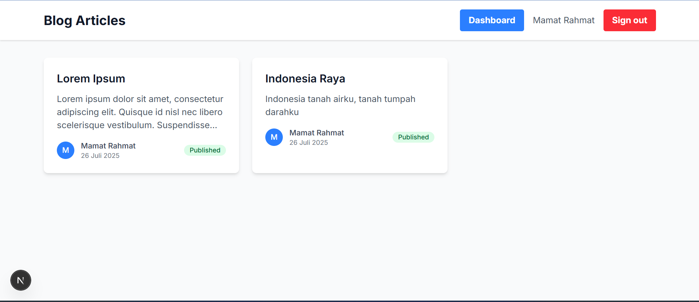
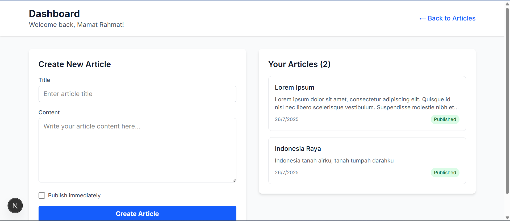

# Next.js Project - Jabar Digital Academy

Proyek ini dibuat untuk memenuhi tugas **Jabar Digital Academy** pertemuan ke-8

## 📋 Tugas Pertemuan Ke-8

### Persyaratan yang Dipenuhi:

- ✅ Menggunakan NextAuth.js sebagai solusi otentikasi utama.
- ✅ Mengimplementasikan middleware untuk membatasi akses ke halaman tertentu hanya bagi user yang telah login.
- ✅ Halaman login dengan metode autentikasi (Email & Password).
- ✅ halaman register agar user bisa mendaftarkan diri ke aplikasi.
- ✅Memiliki minimal 2 halaman yang:
  - Halaman A: Terbuka untuk umum seperti landing page (tidak perlu login)
    
  - Halaman B: Hanya bisa diakses jika user sudah login (dilindungi dengan middleware)
    
- ✅Menampilkan informasi user yang sedang login (nama/email) di halaman B.
- ✅ Mengimplementasikan sign in dan sign out menggunakan NextAuth.


## 🛠️ Teknologi yang Digunakan

- **Next.js 15** - React framework
- **TypeScript** - Type safety
- **Tailwind CSS** - Styling
- **NextAuthJS** - Authentication
- **SQLite** - Database
- **Prisma** - ORM

## 🚀 Cara Menjalankan Project

1. **Clone repository**
   ```bash
   git clone <repository-url>
   cd <project-folder>
   ```

2. **Install dependencies**
   ```bash
   npm install
   ```

3. **Buat file .env dan .env.local**
   ```bash
   NEXTAUTH_URL=http://localhost:3000
   NEXTAUTH_SECRET=your-auth-secret
   DATABASE_URL="file:./dev.db"
   ```

4. **Setup database**
   ```bash
   npx prisma migrate dev --name init
   npx prisma generate
   ```

5. **Jalankan development server**
   ```bash
   npm run dev
   ```

6. **Buka browser**
   ```
   http://localhost:3000
   ```

## 👨‍💻 Pengembang

Dibuat oleh **Mamat Rahmat** untuk tugas Jabar Digital Academy

*Proyek ini dikembangkan sebagai bagian dari program Jabar Digital Academy untuk mempelajari Next.js dan pengembangan web modern.*